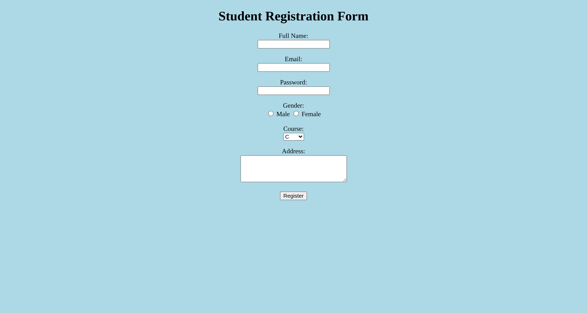

# Student Registration Form – HTML Beginner Project

## 📘 About This Project

This project is created for beginner learners to practice basic HTML design.

It is a simple Student Registration Form made using only HTML.

There is no CSS, no JavaScript, and no backend.

The purpose of this project is to understand how HTML form design works.

---

## 🎯 Learning Objective

After completing this project, learners will understand:

- HTML page structure
- Head and Body tags
- Form creation
- Different input types
- Background color in HTML
- Basic webpage design structure

---

## 🖥 Full Design Information

This project includes a complete basic form design structure:

- Page title
- Background color
- Centered content
- Heading
- Form with multiple input fields
- Proper spacing using line breaks
- Submit button

It represents a fully structured beginner-level webpage using only HTML elements.

---

## 🏷 HTML Tags Used and Their Purpose

| Tag | Purpose |
|------|----------|
| `<html>` | Root element of the HTML page |
| `<head>` | Contains page title and metadata |
| `<title>` | Sets the title shown in browser tab |
| `<body>` | Contains all visible content |
| `
` | Centers the content (basic method) |
| `<h1>` | Main heading of the page |
| `<form>` | Creates a form section |
| `<label>` | Defines label for input fields |
| `<input>` | Creates input fields (text, email, password, radio, submit) |
| `<select>` | Creates dropdown list |
| `<option>` | Defines items inside dropdown |
| `<textarea>` | Creates multi-line text input |
| ` ` | Adds line break / spacing |

---
## 🚀 How to Add and Run HTML Page Using Visual Studio

1. Open Visual Studio and open your project.
2. In Solution Explorer, right click on the project name.
3. Click **Add → New Item → HTML Page**.
4. Name the file `Registration.html` and click **Add**.
5. Paste your HTML code and click **Save**.
6. Right click the project and select **Open Folder in File Explorer**.
7. Double click `Registration.html`to open it in your browser.

## 📸 Output

## 💡 Purpose

This project is fully designed using only basic HTML elements for learning and practice.
It helps beginners understand how a complete webpage is structured from scratch.